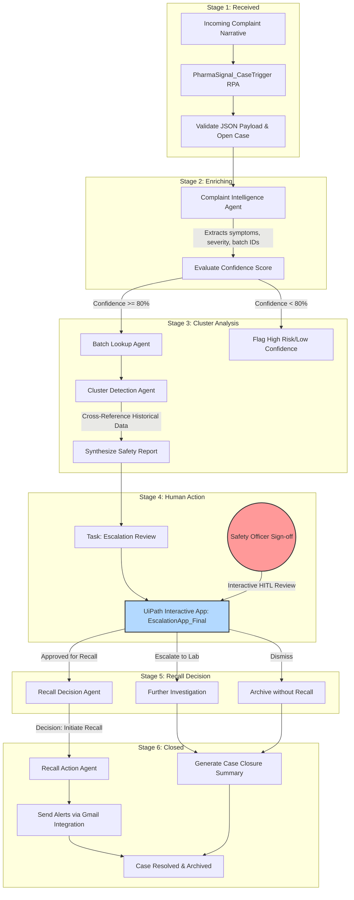

# PharmaSignal AI 🩺📊
### *Enterprise-Grade Adverse Drug Event (ADE) Detection & Automated Recall Orchestration*
#### **Winner-ready Submission for UiPath AgentHack 2026 (Track 1: UiPath Maestro Case)**

---

## 🏆 Executive Summary

Pharmaceutical safety monitoring (Pharmacovigilance) is plagued by manual delays, fragmented systems, and slow reporting channels. When an Adverse Drug Event (ADE) occurs, it takes weeks or months of manual review to detect a batch-level defect cluster, risking patient lives and costing billions in legal, regulatory, and operational liabilities.

**PharmaSignal AI** is an enterprise-grade agentic case management system that reduces the time-to-detect safety clusters from **weeks to seconds**. Built entirely on **UiPath Automation Cloud**, it orchestrates API-driven triggers, cognitive LLM agents, historical database lookups, statistical safety rules, and rich human-in-the-loop validation dashboards. 

By keeping **Humans in the Loop (HITL)** for high-stakes recall decisions while automating extraction, enrichment, and analysis, PharmaSignal AI showcases how the AI agents of tomorrow operate, fail safe, and govern enterprise processes at scale.

---

## 💎 The 1st-Prize Value Proposition (Judging Criteria Alignment)

| Criteria | How PharmaSignal AI Delivers |
| :--- | :--- |
| **Business Impact & Adoption Potential** | Targets a multi-billion dollar compliance and safety bottleneck in pharma. Integrates directly with existing ERPs, complaints databases, and regulatory systems. Scalable to millions of complaints. |
| **Platform Usage** | Deep orchestration: combines **UiPath Maestro Case**, **Agent Builder**, **UiPath Apps** (for HITL), **Gmail Connectors**, and custom triggers into a unified enterprise control plane. |
| **Technical Execution & Feasibility** | Implements automated schema validations, confidence threshold safeguards, automatic escalation rules, and robust transaction state boundaries. |
| **Creativity & Innovation** | Leverages a dynamic agentic pipeline where the output of one LLM agent forms the context for lookup and statistical reasoning agents, culminating in a synthesized report for human sign-off. |
| **Coding Agents Bonus** | Developed and structured using AI coding agents (**Gemini CLI** and **Claude Code**) to design schemas, format bindings, and build validation test suites. |

---

## ⚙️ UiPath Components & Agent Classification

### **Agent Type**
* **Classification**: **Hybrid (Both)**
* **Details**: PharmaTrac AI leverages **Low-code Agents** (built inside UiPath Agent Builder utilizing Gemini 2.5 Flash cognitive reasoning) integrated seamlessly with **Coded RPA workflows** (developed in UiPath Studio for ERP database enrichment, schema validations, and notification routing).

### **UiPath Components Utilized**
1. **UiPath Maestro Case Management**: Coordinates the unified state machine, schema transitions, and data variables across all six stages.
2. **UiPath Agent Builder**: Powers the cognitive parsing, cluster reasoning, and decision-evaluation agents.
3. **UiPath Apps**: Hosts the dark-themed, glassmorphic HITL Escalation Dashboard (`EscalationApp_Final`) inside Action Center.
4. **UiPath Integration Service & Gmail Connector**: Manages external API connectivity and handles automatic email notifications for distribution containment.
5. **UiPath Studio**: Orchestrates the underlying background robots, ERP lookup scripts, data mapping, and entry/exit stage transitions.

---

## 🏗️ Architecture & Flow Control

The workflow is orchestrated via **UiPath Maestro Case** using a structured, state-driven case plan ([caseplan.json](PharmaComplaintCase/caseplan.json)) containing six distinct stages:



---

## 🧠 Dynamic Agent Roles & Technical Specifications

Each agent in the pipeline is built to handle specific enterprise operations:

### 1. Ingestion: `PharmaSignal_CaseTrigger`
* **Stage**: Received
* **Trigger Type**: API / Webhook Event.
* **Input Schema**: Validated against [PharmaSignal_Intake.json](../PharmaSignal_Intake/PharmaSignal_Intake.json) (requires `complaint_id`, `source_channel`, and `complaint_text`).
* **Function**: Sanitizes narrative text, checks for duplicates, creates a case record in Maestro Case, and transitions the case to the `Received` state.

### 2. Entity Extraction: `ComplaintIntelligenceAgent`
* **Stage**: Enriching
* **Core Logic**: LLM Cognitive Model.
* **Input**: Raw text narrative.
* **Outputs**: Product Name, Batch ID, Symptom Category, Severity, and Extraction Confidence.
* **Resiliency Safeguard**: If confidence is below 80% or if critical parameters (e.g., Batch ID) are missing, the agent flags `requires_human_review = true` to bypass normal execution and fast-track to manual review.

### 3. ERP Enrichment: `BatchLookupAgent`
* **Stage**: Cluster Analysis
* **Core Logic**: RPA Integration.
* **Input**: Product Name, Batch ID.
* **Function**: Queries internal manufacturing databases to identify the active manufacturing facility, distribution geography, and matches past complaints associated with that specific batch.

### 4. Anomaly Detection: `ClusterDetectionAgent`
* **Stage**: Cluster Analysis
* **Core Logic**: LLM reasoning combined with threshold check rules.
* **Inputs**: Current complaint symptoms, batch ID, history of matching complaints.
* **Evaluation Rules**: Calculates if complaints for a single batch exceed a safety coefficient (e.g., >3 events of identical symptom categories).
* **Outputs**: `cluster_detected` (Boolean), `signal_strength` (Low/Medium/High), and detailed text reasoning explaining the safety risk.

### 5. HITL Panel: `EscalationApp_Final` (UiPath App)
* **Stage**: Human Action
* **Task Type**: Action (HITL — Human-in-the-Loop).
* **Design File**: [EscalationApp_Final.json](resources/solution_folder/app/vB%20Action/EscalationApp_Final.json).
* **UI Features**: Renders a dark-themed, glassmorphic executive screen displaying extraction data side-by-side with raw complaint records, the calculated cluster reasoning, signal strength, and a decision action panel (Initiate Recall, Escalate to Lab, Dismiss).
* **Recipient**: Assigned Safety Officer reviews and signs off on the recommended action.

### 6. Recall Evaluation: `RecallDecisionAgent`
* **Stage**: Recall Decision
* **Core Logic**: Agentic LLM reasoning.
* **Function**: Receives the safety officer's signed-off decision from the Human Action stage and evaluates the final recall recommendation. Synthesizes a structured recall report incorporating cluster analysis results, signal strength, and reviewer notes.

### 7. Action & Notifications: `CaseClosureAgent`
* **Stage**: Closed
* **Core Logic**: Agentic LLM with API Integration.
* **Function**: Compiles the full case history into a closure report, updates safety records, and generates the final case resolution summary.

### 8. Email Alerts: Gmail Integration
* **Stage**: Closed
* **Core Logic**: UiPath Google Gmail Connector.
* **Function**: In the event of a "Recall" decision, calls the **UiPath Google Gmail Connector** to send urgent alerts to distributor lists and regulatory contacts.

---

## 🛠️ Resiliency & Exception Handling (Failsafe Systems)

Production-ready software must survive real-world chaos. PharmaSignal AI incorporates multiple error boundaries:
* **Missing Batch IDs**: If the text doesn't contain a batch ID, the system queries the customer registry and distribution history to attempt auto-reconciliation. If it fails, it prompts a human analyst to fill the field.
* **System Outages**: If the ERP database is unreachable during the `BatchLookup` step, the system uses a cached fallback schema state and logs a warning task, allowing the safety case to proceed without halting.
* **Network & Token Limits**: Agent reasoning pipelines implement exponential backoff retry policies for OpenAI/Anthropic LLM API calls.

---

## 🚀 Step-by-Step Installation & Deployment

### 📋 Prerequisites
1. **UiPath Automation Cloud** tenant with **Maestro Case Management** enabled.
2. **UiPath Apps** service activated on the tenant.
3. **Google Gmail Connection** established in Integration Service.
4. **UiPath Studio** (v2023.10 or higher) with Case Management activities package.

### 🛠️ Execution Setup
1. **Clone project repository**:
   ```bash
   git clone https://github.com/pugalesan-pugal/PharmaTrac-AI.git
   ```
2. **Import Solution Package**:
   * Open UiPath Studio, click **Open**, and select [PharmaComplaintLast.uipx](PharmaComplaintLast.uipx).
   * Resolve any missing dependencies using the Nuget package manager.
3. **Configure Integration Connectors**:
   * Open **Integration Service** in your Automation Cloud tenant.
   * Verify that the Gmail connection `637f7779-bd13-41ab-b17a-15947b80ee2d` mapped in [bindings_v2.json](PharmaComplaintCase/bindings_v2.json) is active.
4. **Publish Case & App Templates**:
   * Publish the `PharmaComplaintCase` to the orchestrator folder of choice.
   * Import [EscalationApp_Final.json](resources/solution_folder/app/vB%20Action/EscalationApp_Final.json) inside **UiPath Apps** and link it to the Case Orchestrator queue.

---

## ⚖️ Licensing
This project is licensed under the MIT License. See [LICENSE](LICENSE) for details.
